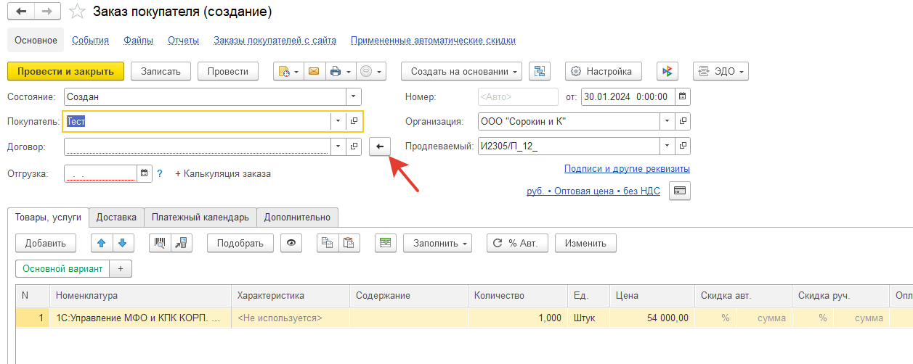
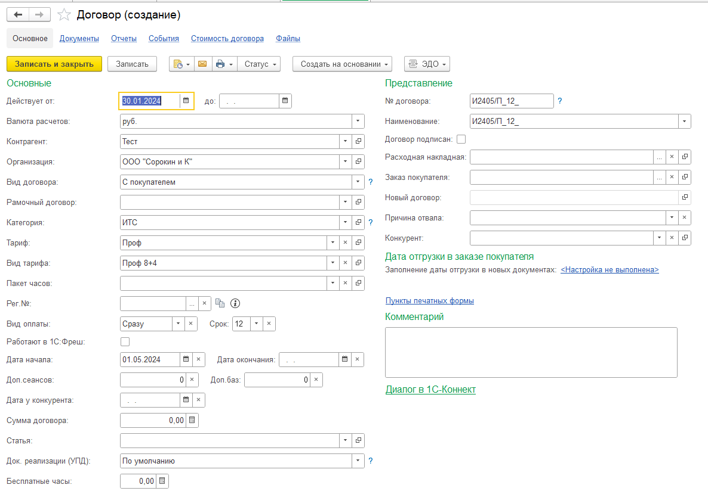

# Продление договора из отчета по тарифам

Для того, чтобы создать договор продления нужно:

* Открыть отчет по тарифам и нажать на договор, который нужно продлить:

* Откроется форма создания заказа покупателя. Она заполнится на основе заказа, который был создан на основе договора, который продлеваем.
Продлеваемый договор установится в реквизит `Продлеваемый`.

* Нажимаем на кнопку `Создать новый договор на основе продлеваемого` (это кнопка со стрелкой влево). Откроется форма создания договора.
Договор будет создан на основе продлеваемого. Дата начала будет заполнена как дата окончания продлеваемого договора + 1 день. Дата окончания должна быть пустой, т.к. мы только начинаем работу над продлением. Дата договора заполнится как текущая дата.

Если в договоре все правильно, нажимаем `Записать и закрыть`.

* После того, как мы сохранили новый договор, он должен был подставиться в заказ покупателя.

* После заполнения необходимых реквизитов в заказе покупателя, записываем заказ. После записи заказа в продлеваемом договоре должен был поменяться статус на `В работе`. Также будет заполнен реквизит `Заказ покупателя`, и будет отображаться ссылка на новый договор.

Если эти действия повторить для договора, у которого уже заполнен `Заказ покупателя`, то из отчета по тарифам откроется заказ покупателя из продлеваемого договора.

## Создание шаблона электронного письма

Если есть необходимость создать шаблон электронного письма, то для Расходной накладной и Заказа покупателя мы добавили все реквизиты, входящие в `Управление небольшой фирмой франчайзи` из договора в параметры шаблона. Там доступны реквизиты как обычного договора, так и продлеваемого.

